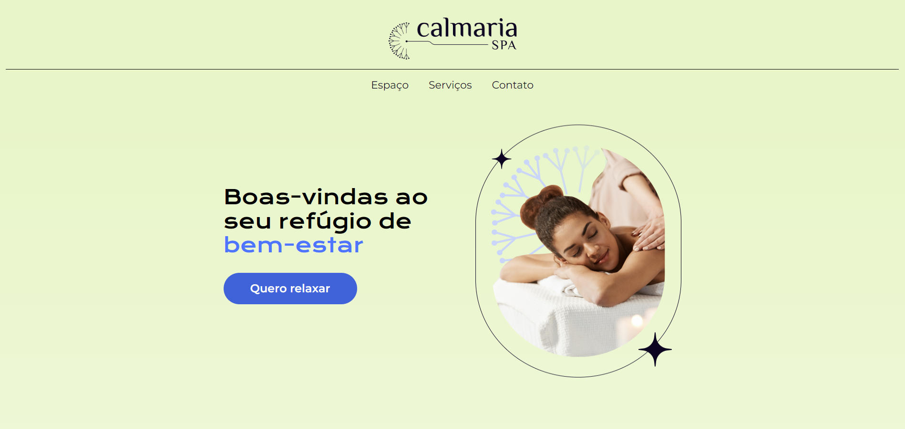

# 💆‍♀️ Calmaria Spa

Projeto de site fictício para um spa relaxante, desenvolvido com HTML, CSS e JavaScript com foco em animações suaves, layout responsivo e código modular. Parte integrante do meu portfólio profissional.

---

## 🌐 Acesse o Projeto Online

👉 [https://calmaria-spa-mu.vercel.app](https://calmaria-spa-mu.vercel.app)

## 📸 Demonstração



---

## 🚀 Funcionalidades

- Layout 100% responsivo
- Animações suaves ao rolar a página (scroll reveal)
- Estrutura modular com CSS separado por seções
- Formulário de contato estilizado
- Ícones e imagens integrados com foco no bem-estar

---

## 📁 Estrutura de Pastas

```plaintext
calmaria-spa/
├── assets/                         # Imagens, ícones e vetores
│   ├── home-image.png
│   ├── logo.png
│   ├── espaco-1.png
│   ├── espaco-2.png
│   ├── espaco-3.png
│   ├── icon-massagem.png
│   ├── icon-tratamentos.png
│   ├── icon-dias-especiais.png
│   ├── contato-img-1.png
│   ├── contato-img-2.png
│   ├── contato-img-3.png
│   └── (outros SVGs e ícones)
├── styles/                         # CSS organizado por componente
│   ├── style.css
│   ├── cabecalho.css
│   ├── container--primeiro.css
│   ├── container--secao.css
│   ├── container--cards.css
│   ├── container--inscricao.css
│   ├── container--contato.css
│   ├── rodape.css
│   └── responsivo.css
├── index.html                      # Estrutura principal da página
├── script.js                       # Lógica JS para animações
└── README.md                       # Documentação do projeto
```
##

## 🛠️ Tecnologias Utilizadas

- HTML5

- CSS3

- JavaScript Vanilla

- Google Fonts

- SVGs personalizados

- Responsividade Mobile First
##
## 👨‍💻 Autor

**Bruno dos Santos**  
📞 (21) 98048-8310  


📧 wanderley.bruno@gmail.com  

🔗 [LinkedIn](https://www.linkedin.com/in/wanderley-bruno/)


